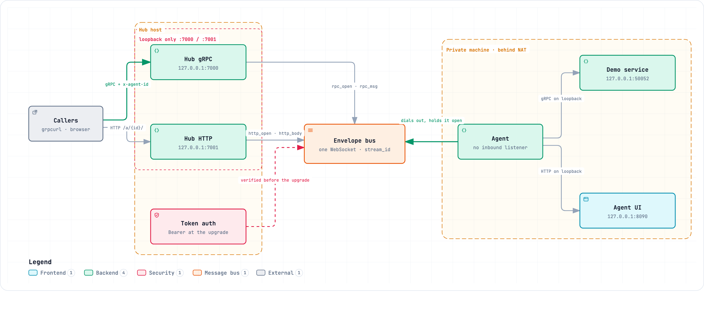

# Tunnel PoC

An agent with no inbound listener becomes controllable over gRPC through a
WebSocket connection it opens itself, and makes its local web UI reachable
through that same channel.

## Running it

    make demo

That builds and starts all three processes with the tokens from the Makefile.
If you start `hub` and `agent` directly instead, the hub needs `HUB_TOKENS`
(format `id:token,id:token`, e.g. `mac-1:secret1`) and the agent needs the
matching `AGENT_TOKEN` — without `HUB_TOKENS` the hub exits immediately with
`HUB_TOKENS is empty`.

Then:

- Hub UI with the agent list and the envelope inspector: <http://127.0.0.1:7001/>
- Agent UI through the tunnel: <http://127.0.0.1:7001/a/mac-1/>
- gRPC through the tunnel:

      go tool grpcurl -plaintext -import-path proto -proto demo/v1/demo.proto \
        -H 'x-agent-id: mac-1' -d '{"text":"hallo"}' \
        127.0.0.1:7000 demo.v1.Demo/Echo

`buf` and `grpcurl` are go.mod tool dependencies and pull in a large set of
indirect modules. They are needed only for code generation and for calls made
by hand; the PoC itself uses neither at runtime — and no Docker.

## How it is put together

`internal/bus` carries tagged envelopes with a `stream_id` over one WebSocket
and knows nothing about gRPC or HTTP. `internal/relay` holds its two users,
split so neither half can reach into the other:

    internal/relay/wire         what both halves share
    internal/relay/hubrelay     accepts callers, puts their calls on the bus
    internal/relay/agentrelay   takes calls off the bus, replays them locally

The gRPC relay passes raw message bytes through, which is why any gRPC service
is tunnelable without a code change. The hub and agent binaries link only their
own half; `internal/relay/boundary_test.go` fails if that ever stops being true.

Note the arrow between agent and bus: it points against the flow of traffic.
Calls travel from the caller through the hub to the agent, but the *connection*
is opened by the agent — which is what lets this work through NAT with no
inbound listener on the private machine.

The image is a still. `docs/diagrams/tunnel-architecture.html` is the same
diagram interactively, with light and dark themes, relationship tracing and
three guided views.

## Limits

Callers are not authenticated: whoever reaches the hub reaches every connected
agent. Both hub listeners therefore bind to `127.0.0.1` by default (override
with `-grpc-addr`/`-http-addr`). Caller authentication has to come first before
this runs on a public address.

The connection between agent and hub is unencrypted: `-hub` points at a `ws://`
target by default, and the agent sends its `Authorization: Bearer <token>` —
along with everything tunnelled — in cleartext. Pointing it at a remote hub is
one flag argument away, so a `wss://` endpoint with TLS belongs in front of that
first.

The HTTP relay handler waits for the request body to finish before it returns.
The hub does set `ReadTimeout`/`ReadHeaderTimeout` on its `http.Server` for
that, but those only bound how long a single request may spend reading — a
caller holding many parallel requests open, each staying just under the timeout,
can still occupy several handler goroutines and registry entries at once.
Conversely, that same `ReadTimeout` cuts off every tunnelled upload after 30 s,
however large it is.
